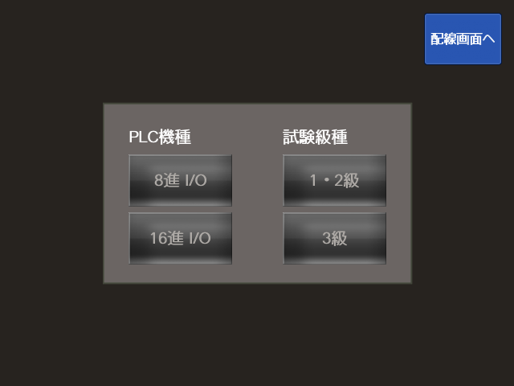
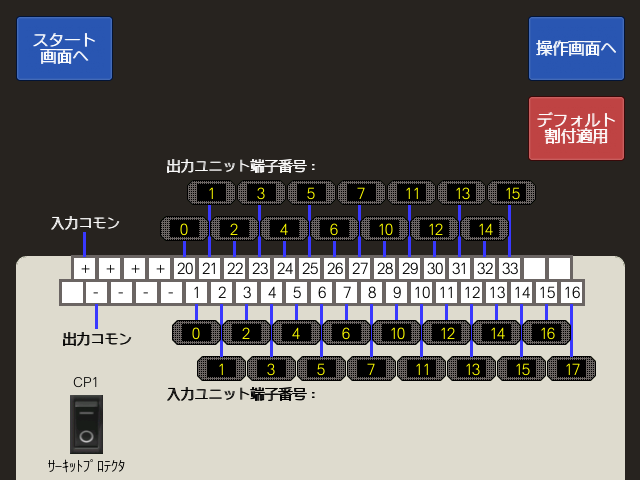
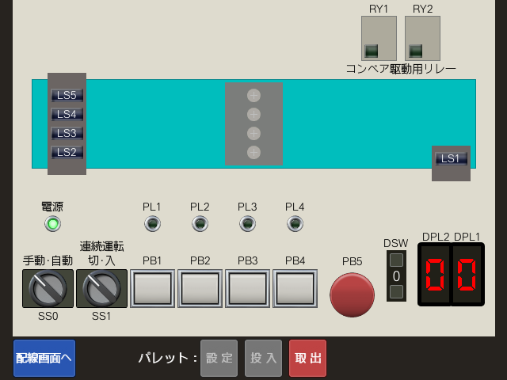

:toc:
:toclevels: 5
:toc-title: 目次
:tip-caption: :bulb:
:note-caption: :information_source:
:important-caption: :heavy_exclamation_mark:
:caution-caption: :warning:
:warning-caption: :rotating_light:
:experimental:

= SQ Simulator

== 概要

SQ Simulator は、link:https://www.javada.or.jp/jigyou/gino/sagyou_naiyou.html#b184_010[技能検定 シーケンス制御職種 シーケンス制御作業] の製作等作業試験で使われる「試験用盤」をPC上で再現し、実機無しの試験対策を可能にするシミュレーションツールです。試験対策だけでなく、基礎的なPLCプログラミングの学習にも使用できます。

image::docs/images/sq-simulator_紹介.gif[]

== 必要ツール

* GT Designer3 (GOT2000)

* 下記のいずれか

** GX Works2

** GX Works3

** MELSECシリーズPLC本体

SQ Simulator は 「GT Designer3 (GOT2000)」によりGOT2000用プロジェクトファイルとして実装されているため、利用にはGT Designer3 (GOT2000) が必要です。また、GT Designer3 に付属の「GT Simulator3」とPLCプログラムを実行するために、GX Works2/3 に付属の GX Simulator も併せて必要です。

[NOTE]
====
各ソフトウェアは体験版が無償で利用可能です。

* link:https://www.mitsubishielectric.co.jp/fa/download/software/detailsearch.page?mode=software&kisyu=/got&shiryoid=0000000018[GT Designer3 (GOT2000)]

* link:https://www.mitsubishielectric.co.jp/fa/download/software/detailsearch.page?mode=software&kisyu=/plcq&shiryoid=0000000012[GX Works2]

* link:https://www.mitsubishielectric.co.jp/fa/download/software/detailsearch.page?mode=software&kisyu=/plcq&shiryoid=0000000374[GX Works3]
====

== ダウンロード

link:https://github.com/avenue68/sq-simulator/releases[こちら]から最新バージョンの `sq-simulator.GTX` をダウンロードし、解凍してください。試験用盤制御用のサンプル GX Works プロジェクトもダウンロード可能です。

== 起動方法

各種ツールの使用方法は対応する公式マニュアルを参照してください。

. 実行する GX Works プロジェクトファイルを GX Works3 または GX Works2 で開きます。

. 開いた GX Works プロジェクト上で GX Simulator を起動し、PLCプログラムを GX Simulator に書き込みます。

** GX Works 上でキーボードを kbd:[Alt] → kbd:[B] → kbd:[S] の順に押下すると、GX Simulator が起動します。

. `sq-simulator.GTX` ファイルを GT Designer3 (GOT2000) で開きます。

. ユーザー名およびパスワードを求められるので、下記の通り入力します。

** ユーザー名: `user`

** パスワード: `password`

. 使用する GX Simulator に合わせ、GT Simulator3 の接続先を設定します。

. GT Simulator3 を起動します。

** GT Designer3 上でキーボードの kbd:[Ctrl] + kbd:[F10] を押下すると、GT Simulator3 が起動します。

. GT Simulator3 上で SQ Simulator が実行されます。

== 操作方法

=== スタート画面

実行するGX Worksプロジェクトの対象PLC機種および受験する級を選択し、SQ Simulator の挙動を設定するための画面です。

==== PLC機種

実行するGX Worksプロジェクトの対象PLC機種が、入出力アドレスが8進の機種（MELSEC-Fシリーズ / MELSEC iQ-Fシリーズなど）か、16進の機種（MELSEC-Qシリーズ / MELSEC iQ-Rシリーズなど）かを選択します。

==== 試験級種

受験する技能検定の級を選択します。3級を選択すると制御対象の入出力機器が少なくなります。

[NOTE]
====
詳細は製作等作業試験の問題概要を参照してください。

* https://www.kentei.javada.or.jp/
====

=== 配線画面

PLC入出力ユニットと試験用盤配線用端子台間の配線をシミュレーションするための画面です。試験用盤配線用端子台の各端子番号に対し、PLCの入出力ユニットの端子番号（入出力アドレス）を入力（配線）していきます。

スタート画面でPLC機種を `16進 I/O` に設定した場合は、入出力ユニットの端子番号に加えて入出力ユニットの先頭XY番号も入力してください。

==== デフォルト割付適用ボタン

デフォルト割付適用ボタンを押下すると、下記のI/O割付表に従って自動入力されます。

[%header%autowidth, cols="^.^,^.^,^.^,^.^,^.^,^.^"]
|===
|PLC入力 +
ビット位置

|TB +
端子No.

|入力信号名

|PLC出力 +
ビット位置

|TB +
端子No.

|入力信号名

|0  |1  |LS1：コンベヤ右端 |0  |20 |RY1：コンベヤ左行
|1  |2  |LS2：コンベヤ左端 |1  |21 |RY2：コンベヤ右行
|2  |3  |LS3：品番検出用   |2  |22 |PL1
|3  |4  |LS4：品番検出用   |3  |23 |PL2
|4  |5  |LS5：品番検出用   |4  |24 |PL3
|5  |6  |PB1             |5  |25 |PL4
|6  |7  |PB2             |6  |26 |DPL1：1
|7  |8  |PB3             |7  |27 |DPL1：2
|8  |9  |PB4             |8  |28 |DPL1：4
|9  |10 |PB5             |9  |29 |DPL1：8
|10 |11 |SS1：入側でON    |10 |30 |DPL2：1
|11 |12 |SS0：自動側でON   |11 |31 |DPL2：2
|12 |13 |DSW：1          |12 |32 |DPL2：4
|13 |14 |DSW：2          |13 |33 |DPL2：8
|14 |15 |DSW：4          |-  |-  |-
|15 |16 |DSW：5          |-  |-  |-
|===

実際の試験ではI/O割付表の内容は試験回ごとにランダムに指定されるので、学習内容に応じて適宜使用してください。

==== CP1 サーキットプロテクタ

試験用盤のサーキットプロテクタ兼電源スイッチです。操作画面に遷移する前にCP1をONにしてください。

CP1がONのまま入出力ユニット端子番号を変更しようとした場合、警告が表示されます。試験では電源が入ったまま配線作業を行うとその時点で不合格になると言われているので、SQ Simulator 使用時もこの警告が表示されないよう注意してください。

=== 操作画面

ボタン操作等により試験用盤を動作させるための画面です。操作画面に遷移したら、GX Simulator を一度リセットするようにしてください。（配線画面時点ですでに GX Simulator 上のPLCプログラムが実行されている場合、PLCプログラムが不正な状態になる可能性があるため。）

[IMPORTANT]
====
GX Simulator によるPLCプログラムの実行時はスキャンタイムが100msと長くなるため、SQ Simulator 上の入出力のレスポンスはPLC実機で試験用盤を制御しているときよりも遅くなり、以下のような挙動が見られる場合があります。

* PBを押下したら即座にPLが点灯するプログラムのはずなのに、PLの点灯が遅れる。

* パレットがコンベヤ左端に到達したとき、即座にLS3-5で読み取ったビスの取り付け状態がDPLに表示されるプログラムのはずなのに、DPLへの表示が遅れる。

操作画面の挙動に違和感がある場合は、GX Works でPLCプログラムをモニタし、SQ Simulator の表示が遅れているだけなのかPLCプログラムに誤りがあるのか確認してください。
====

==== パレット

投入ボタン / 取出ボタンでは、コンベヤ上へのパレットの投入 / 取出が行えます。設定ボタンを押下するとパレット設定ウィンドウが表示され、パレット上のLS3-LS5検出用ビスそれぞれの有無を設定できます。 コンベヤ上のパレットはマウス操作で移動させることもできます。

[NOTE]
試験においてコンベヤ左端・右端検出用（LS1・LS2検出用）ビスが取り外されることはないので、パレット設定ウィンドウでも取り外し不可になっています。

==== コンベヤ

コンベヤ上にパレットが存在しない状態でコンベヤが駆動されたとき、駆動方向を示す矢印が点滅します。

==== LS1 - LS5 手動操作用スイッチ

コンベヤ上にパレットが存在しないとき、各LSのON/OFFを手動で操作するためのスイッチが表示されます。これは試験中、PLCプログラムの動作確認時間を短縮するために手指で直接LSをON/OFFする操作をシミュレーションするための機能です。

== 利用許諾

本ソフトは無料でダウンロード・利用できます。
ただし、作者の事前許可なく本ソフト（改変物を含む）の販売・有償配布、および再公開（ミラー／再配布／同梱配布／アプリストア等への掲載）を禁じます。
紹介・共有の際は本ページへのリンクをご利用ください。再アップロードは不可です。

== 問い合わせ

SQ Simulator に関する問い合わせ等は、GitHubのlink:https://github.com/avenue68/sq-simulator/issues/new/choose[issue機能]を使用していただくか、下記Eメールアドレスまでご連絡ください。

* 問い合わせ先Eメールアドレス：sq-simulator@outlook.jp
